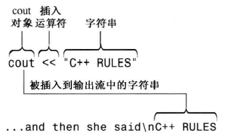

# 2.1 进入C++
第一个示例程序：myfirst.cpp
```c++
#include <bits/stdc++.h>
using namespace std;
int main()
{
    cout << "Come up and C++ me some time.";
    cout << endl;
    cout << "You won't regret it!" << endl;
    return 0;
}
```
## 2.11 main()函数
* 在c++11强制标准中，mian应定义为int类型，在某些也需要写成void类型，然而因为void不是强制标准，所以部分环境下是无法编译的，考虑到软件的泛用性，最好写成int类型。在C语言中，mian的类型声明可以省略，默认类型为int类型。C++中，`()`和`(void)`等效，表示不接受任何参数，C中不一样（空着表示沉默？）。另外，ISO的C++标准允许没有`return x`语句，在函数结尾默认加入`return 0`。
* C++独立程序的入口规定必须是`main()`，并且大小写敏感。 在某些DLL模块或者特殊环境中，可以没有`mian()`函数。当然，他也会调用其他名字的主函数。
## 2.12 注释
两种注释方式：
1. `// xxxxxxx`
2. `/* xxxxxxx*/`
## 2.13 预处理文件
C++内置一个预处理器，在程序进行主编译之前对源文件进行处理。
> C++程序编译过程：C++源程序－>编译预处理－>编译－>汇编程序－>链接程序－>可执行文件 
>     1. 编译预处理： 读取源代码，处理伪指令和特殊符号。伪指令包括宏定义、条件编译、头文件，特殊符号包括`LINE`、`FILE`等。
>     2. 编译： 将预编译生成的文件翻译成中间代码/汇编代码，生成汇编文件
>     3. 汇编： 将中间代码/汇编代码翻译成机器码，生成目标文件
>     4. 链接： 将汇编产生的目标文件链接起来，还包括引用的库、调用的库文件函数等。链接完成之后即可生成可执行文件。
## 2.14 头文件
C++兼容老式的C头文件，如math.h，在C头文件中使用C++特性，最好还是找C++的头文件，如math.h -> cmath（ISO标准委员会要求不使用任何扩展名）
## 2.15 命名空间
* 命名空间使用`using`编译指令，这是编译指令的一种。
* 命名空间可以理解为对一块空间的命名。如有两个封装好的库，分别都有一个`check()`的方法，使用命名空间来区分不同的库的不同的`check()`方法。`A::check()`，`B::check()`
* `using namespace std`让std对其空间内的所有名称可用，还可以麻烦点，在代码内使用`std::cout`。在`using`中也可以指定命名空间的名称，如`using std::cout`。这样可以避免一些潜在的风险。
## 2.16 Cout输出语句

`cout<< "xxx" << endl`中，cout是一个预定义好的对象，负责输出。<<是插入运算符，可以重载。endl为换行控制符，可以用`\n`代替。
## 2.17 代码格式化
尽管每个人的代码风格不尽相同，但是代码风格是一个很重要的事情，直接影响代码可读性和重构的难易度。尽量使用通用的代码风格，注意控制缩进、括号位置等。