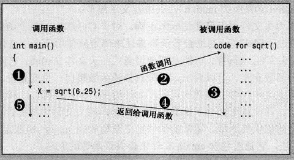
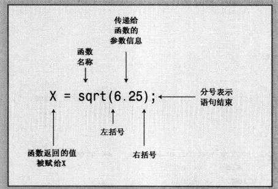
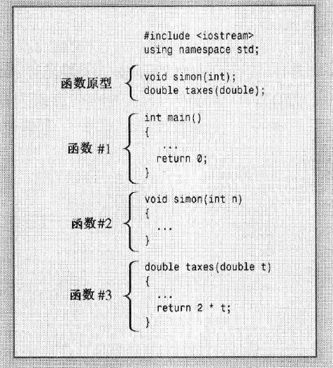

<!--
 * @Description: 
 * @Author: Andew
 * @Date: 2019-10-12 14:40:09
 * @LastEditors: Andrew
 * @LastEditTime: 2019-10-14 09:03:59
 -->

# 2.4 函数

## 2.4.1 有返回值的函数



> 函数定义、函数原型、函数调用
>   1. 函数定义即定义一个函数：形如 ：`double sqrt(double x){・・・・}`
>   2. 函数调用即调用这个函数，形如 ：`double value = sqrt(x);`
>   3. 函数原型即函数声明，如 `double sqrt(double);`编译系统要求先编译函数，再调用函数。也就是定义要放在函数之前。但是不放也可以，通过声明语句声明某处有个函数，在之后再实现这个函数即可。所以原型描述的是函数的接口，是一种声明方式。通常放在mian函数之前。

```c++
// sqrt.cpp
#include <bits/stdc++.h>
// #include <cmath>
using namespace std;

int main()
{
    double area;
    cout << "Enter the floot area,int sqare feet,of your home:" << endl;
    cin >> area;
    double side;
    side = sqrt(area);
    cout << side << endl;
    return 0;
}
```

类似于函数的声明，库函数在使用前也要声明。`#include <bits/stdc++.h>`包含了大部分常用的库。程序编译时，会自动搜索相应的库函数。注意<>和""搜索路径不一样。

## 2.4.2 函数的变体

## 2.4.3 自定义函数



## 2.4.4 有返回值的自定义函数

## 2.4.5 在多函数程序中使用using指令

根据不同的需求using的位置也可以不同，甚至可以完全不用using指令，使用`std::`的指令来指定。