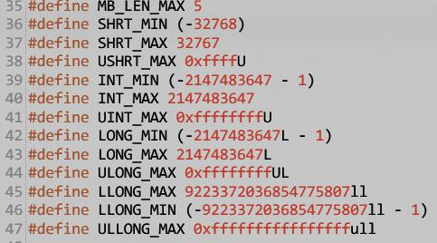
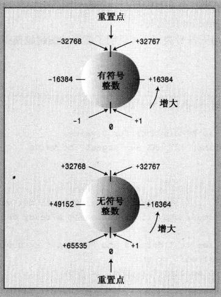
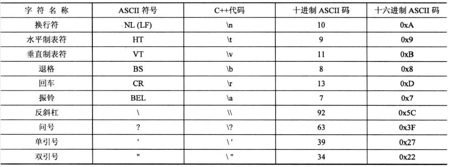

<!--
 * @Description: Chapter 0301
 * @Author: Andew
 * @Date: 2019-10-14 09:07:40
 * @LastEditors: Andrew
 * @LastEditTime: 2019-10-16 16:44:57
 -->

# 3.1 简单变量

定义一个变量后，系统根据变量类型的不同在内存的不同区域分配一个空间，将值复制到内存中，然后用户通过变量名访问这个空间。

## 3.1.1 变量名

* 变量名的命名规则: 

  1. 只能使用字母、数字、下划线 
  2. 第一个字符不能是数字
  3. 区分大小写
  4. 不能使用关键字
  5. **以两个下划线/下划线和大学字符开头的名称保留给实现使用，以一个下划线开头的名称保留给实现，用作全局标识符(c++程序的所有源文件可用)**
  6. 部分环境对变量名长度有要求

## 3.1.2 & 3.1.3 整型以及其扩展

> 计算机的基本单位是bit(位)，一个bit分为0/1两种状态，8bit能表示256种不同的状态。一个字节通常意义上由8bit组成。1KB=1024字节。
`int、short、long、long long`都表示整型，但是他们的位数不同，所以表示的数值的范围也就不同。不同的类型规定了不同的最小长度。具体如下：

  * Short 16位
  * int   16位
  * long  32位
  * long long 64位
    > [cppreference详细说明](https://zh.cppreference.com/w/cpp/language/types)

不同位数的系统中，整型的长度不一样。主要区别在于long类型和指针类型。16位机器中，long占4字节，不支持longlong类型，指针为2个字节。32位机器中，long占4字节，longlong占8个字节，指针占4个字节。64位系统中，long占8个字节，longlong8个字节，指针8个字节。

```c++
// lismits.cpp
#include <bits/stdc++.h>
using namespace std;

int main()
{
    int n_8_int = INT8_MAX;
    int n_16_int = INT16_MAX;
    int n_32_int = INT32_MAX;
    int n_64_int = INT64_MAX;
    int n_int = INT_MAX;

    short n_short = SHRT_MAX;
    cout << "int 在不同机器上的大小：" << endl;
    cout << "8位" << n_8_int << endl;
    cout << "16位" << n_16_int << endl;
    cout << "32位" << n_32_int << endl;
    cout << "64位" << n_64_int << endl;
    cout << "本机" << n_int << endl;
    return 0;
}
```

其余类型在自己机器中的最大最小长度查看limits.h


> 上图中用到了大量的#define指令。define是一个预编译指令，它在预编译阶段使用类似于查找替换的方式，将代码中的所同名的变量替换为具体的值。这是C语言的遗留方法。#define在C++标准中不推荐使用，它的优缺点如下：
> 优点：
>   * 方便修改，一次修改全部改变
>   * 提高运行效率 在define中写一些简短的函数
> 缺点：
>   * **没有类型检查**，这个是致命伤，C++中推荐使用Const
>   * 括号边界问题，直接替换容易报错。如`#define MUL(a,b) a*b`,代码中的`MUL(a+b,c)`就会变成`a+b*c`,因为是直接替换。
>   * 函数边界问题。上面的问题在函数中也会出现，应该使用**inline内联函数**来代替#define。内联函数以牺牲空间的方法，来继承#define的有点，它采用传参的方式使用函数，有类型检查来保证程序的安全。可以进行调试，可以访问类中成员。内联函数要求必须要小，程序自动判断是否能作为内联函数调用，如果不能就当作普通函数调用。 内联函数一般只有几行代码，且不能有递归。

初始化的方式：
    * `int a = 10;`
    * `int a(10);` 下面是C++专属
    * `int a = {10};`
    * `int a{10}`
    * `int a = {}` //默认初始化为0 
还可以先声明，再在使用的时候赋值。先声明不赋值的话系统会自动赋值，然而为了避免莫名奇妙的Bug和浪费空间，还是声明的时候赋值比较好。

## 3.1.4 无符号类型

可以将整型类型的大小范围看作是一个首尾相连的圈。对于short类型，范围是-32768~32767。如果a=32767，那么a+1 = -32768，此时，short类型溢出了。

将符号定义为unsigned short后，因为是无符号类型，范围变为0~6553。所以如果b = 0,则b-1 = 65535，同样溢出。 如何定义你的整型类型要看你的需求和程序执行过程中这个变量的影响范围。定义成无符号型在特定情况下既能省内存，又不会溢出。



## 3.1.5

## 3.1.6 各类进制

```c++
//hexoct.cpp
#include <bits/stdc++.h>
using namespace std;

void change_to_binary(int);

int main()
{
    int a = 42;
    int b = 0x42;
    int c = 042;

    cout << "十进制的 42:" << a << endl;
    cout << "十六进制的 0x42:" << b << endl;
    cout << "八进制的 042:" << c << endl;

    int d = 42;
    cout << "42转十六进制: " << hex << d << endl;
    cout << "42转8进制: " << oct << d << endl;

    char buff[20] = "1239271";
    char *stop;
    cout << "转化为八进制结果： " << strtol(buff, &stop, 8) << endl;
    cout << "转化为十六进制结果： " << strtol(buff, &stop, 16) << endl;

    int num = 99;
    char str[100];
    itoa(99, str, 8);
    cout << "99转化为八进制" << str << endl;
    itoa(99, str, 16);
    cout << "99转化为十六进制" << str << endl;

    change_to_binary(10);
    return 0;
}

void change_to_binary(int value)
{
    for (int i = 32; i >= 0; i--)
    {
        if (value & (1 << i))
            cout << "1";
        else
        {
            cout << "0";
        }
    }
    cout << endl;
}
```

十六进制和八进制可以直接用十进制输出，cout自动识别并转换。
反过来，十进制转换为十六进制或十进制使用控制符`hex`、`oct`，通过控制符来告诉cout类按照什么方式输出。

* 转换方法:

   1.使用库函数`itoa`和`strtol`

   2.使用`hex`、`oct`控制符

   3.使用位运算(二进制)

## 3.1.7 C++如何自动确定常量的类型

除非有其他特殊的理由，如值太大、类型通过后缀指定了等，否则一律默认存储为int类型。

* 后缀:
  * U/u表示unsigned类型
  * L/l表示long类型
  * ul表示unsigned long类型
  * LL/ll表示long long 类型
  * (其他还有多种组合。。。。。。以此类推)
* 值的大小：
  * 每个类型都有固定的范围，超过范围就存为更大范围的类型

## 3.1.8 char类型

* char类型也是一种整型，然而他存的是数字和字母。根据ASCII表，char存字母时，实际上存的是字母对应的数字编码。(除了ASCII表，还有其他对应的编码标准)

```c++
#include <bits/stdc++.h>
using namespace std;

int main()
{
    char ch = 'M';
    int i = ch;
    cout << ch << "的ASCII编码是" << i << endl;

    ch = ch + 1;
    i = ch;
    cout << "+1之后的编码是" << i << ",字母是" << ch << endl;

    cout << "使用cout.put()函数：" << endl;
    cout.put(ch);
    cout.put('!');
    return 0;
  // 变量ch的值为M,存入的是其数字编码77,`ch+1`就是77+1,输出的就是78对应的字母N。
}
```

* **转义字符**：有一些字符无法通过键盘输入到cout中，如回车、制表等，还有些会被识别为代码，如“”等，此时就需要用转义字符。


* char类型可以是无符号，也可以是有符号
  * `char ch` 这个可以是有符号也可以是无符号
  * `unsigned char ch` 无符号
  * `signed char ch` 有符号

* wcha_t: 宽体char  `wcha_t bob = L'p'`
* char16_t / char32_t 长为16/32位的字符类型

## 3.1.9 bool类型

显示赋值： true / false、
隐式赋值： 非0值为true，0为false
